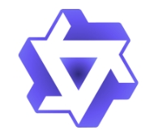








 I work at Tongyi Lab  , Alibaba Group  , as an AI researcher now in Hangzhou.

 I graduated from Wuhan University with a bachelor’s degree and Tsinghua University with a master's degree, advised by Prof. [Haoqian Wang](https://www.sigs.tsinghua.edu.cn/whq/). Currently, my research topic is 3D vision, with a particular focus on 3D reconstruction and generation. 
 
 <!-- Click [cv](../assets/cv.pdf) for more details. -->

<!-- My research interest includes neural machine translation and computer vision. I have published more than 100 papers at the top international AI conferences with total <a href='https://scholar.google.com/citations?user=DhtAFkwAAAAJ'>google scholar citations <strong>260000+</strong></a> (You can also use google scholar badge ). -->

# 🔥 News
- *2024.07*: &nbsp;🎉🎉 I join Tongyi Lab  , Alibaba Group  , as a 3D vision research scientist in Hangzhou, China!
- - *2024.07*: &nbsp;🎉🎉 One paper is accepted by ECCV 2024!

# 📝 Publications 

ICCV 2023

[NeRF-MS: Neural Radiance Fields with Multi-Sequence](https://openaccess.thecvf.com/content/ICCV2023/html/Li_NeRF-MS_Neural_Radiance_Fields_with_Multi-Sequence_ICCV_2023_paper.html)

**Peihao Li**, Shaohui Wang, Chen Yang, Bingbing Liu, Weichao Qiu, Haoqian Wang

[**Project**](https://nerf-ms.github.io/) 
- NeRF-MS trains neural radiance fields from multiple sequences captured by different sensors and at different times. 

- ``ECCV 2024`` [Gaussian in the Wild: 3D Gaussian Splatting for Unconstrained Image Collections](https://arxiv.org/abs/2403.15704), Dongbin Zhang, Chuming Wang, Weitao Wang, **Peihao Li**, et al.

- ``CVPR 2023`` [NeRFVS: Neural Radiance Fields for Free View Synthesis via Geometry Scaffolds](https://openaccess.thecvf.com/content/CVPR2023/html/Yang_NeRFVS_Neural_Radiance_Fields_for_Free_View_Synthesis_via_Geometry_CVPR_2023_paper.html), Chen Yang, **Peihao Li**, et al.

# 🎖 Honors and Awards
- *2023* Ordos Talent Scholarship, Tsinghua University. 
- *2020* National Scholarship, Ministry of Education of P.R. China.
- *2019* National 1st Award, [CUMCM](http://www.mcm.edu.cn/), China.

# 📖 Educations
- *2021.09 - 2024.06*, Master, Tsinghua University. 
- *2017.09 - 2021.06*, Undergraduate, Wuhan University. 

<!-- # 💬 Invited Talks
- *2021.06*, Lorem ipsum dolor sit amet, consectetur adipiscing elit. Vivamus ornare aliquet ipsum, ac tempus justo dapibus sit amet. 
- *2021.03*, Lorem ipsum dolor sit amet, consectetur adipiscing elit. Vivamus ornare aliquet ipsum, ac tempus justo dapibus sit amet.  \| [\[video\]](https://github.com/) -->

# 💻 Internships
- *2022.07 - 2023.03*, Huawei, Noah’s Ark Lab, Shenzhen.
- *2020.08 - 2020.11*, Bytedance, Beijing.
